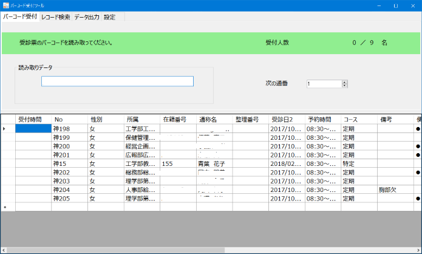

**バーコード受付処理ツールマニュアル**

平成30年5月28日　青葉レントゲン株式会社

情報システム課　開発責任者　安野　浩憲

1.  **バーコード受付処理ツール利用にあたって**

バーコード受付処理ツールを利用する際の手順と注意事項を簡潔にまとめました。お読みいただいた上、何か分からない点があれば、情報システム課責任者（安野）までご連絡ください。

2.  **利用手順フロー\
    **

3.  {width="5.752083333333333in"
    height="3.4435345581802275in"}**詳細\
    画面レイアウト\
    \
    \
    \
    \
    \
    \
    \
    \
    \
    \
    \
    \
    \
    \
    \
    **

    -   {width="0.4666666666666667in"
        height="0.4527777777777778in"}**健診簿のインポート\
        **

        1.  バーコード受付処理ツールを起動します。

        2.  健診簿の表示スペースに、インポートしたい健診簿ファイル(xlsx形式)をドラッグ・ドロップして下さい。

        3.  {width="3.158333333333333in"
            height="1.8967497812773404in"}表示スペースに健診簿のデータが表示されます。

    -   **受診票のバーコード読み取り\
        **

<!-- -->

1.  フォームの読み取りデータ欄にカーソルがあるのを確認します。この時、上部のメッセージに「**受診票のバーコードを読み取って下さい**」と表示されます。

2.  {width="4.725in"
    height="1.7354166666666666in"}受診票のバーコードをバーコードリーダーで読み取ります。

3.  健診簿に該当するレコードがあれば、本人確認ダイアログが開きます。（詳細は次項）

4.  該当するレコードが無ければ、本人確認失敗になります。再度読み取るか、又はバーコード読み取り欄に直接手入力して下さい。

    -   {width="4.391666666666667in"
        height="3.236111111111111in"}**本人確認\
        画面レイアウト\
        \
        \
        \
        \
        \
        \
        \
        \
        \
        \
        \
        \
        \
        \
        \
        **

<!-- -->

1.  本人確認ダイアログに該当者の健診情報が表示されます。

2.  受診票と照らし合わせて、本人に間違いなければ、「確定」ボタンを押して下さい。

3.  {width="4.989744094488189in"
    height="0.9333333333333333in"}健診簿の該当者の整理番号に通番、受付時間に受付時刻が登録されます。

    4.  ここで問題が無ければ、次の受診者について「＞受診票のバーコード読み取り」を繰り返します。問題があれば、次の「＞必要な修正等」を実施して下さい。

    -   **必要な修正等\
        **

<!-- -->

1.  整理番号を変更したい場合は、登録したレコードの整理番号カラムのデータをクリックします。

2.  {width="4.733333333333333in"
    height="1.075in"}整理番号に希望する通番の数字を入力してエンターキーを押して下さい。

3.  整理番号と受付時間が更新されます。

    -   **更新した健診簿の保存\
        **

<!-- -->

1.  {width="5.083333333333333in"
    height="1.1957097550306213in"}データ出力タブを開きます。

2.  ファイル出力先を指定し、「エクセルファイルに出力」ボタンを押して下さい。

3.  出力先パスに「\[当日の日付\]
    受付後健診簿.xlsx」の名前のファイルが作成されます。

{width="0.9666666666666667in"
height="0.8377777777777777in"}
