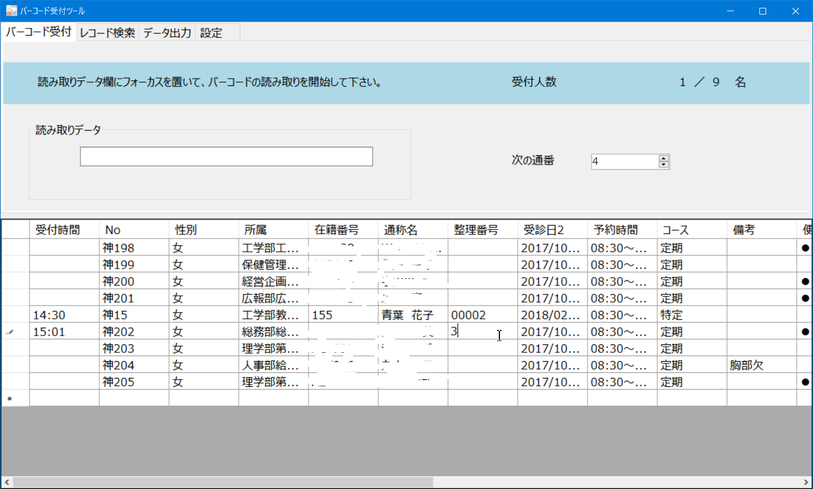

**バーコード受付処理ツールマニュアル**

平成30年5月28日　

1.  **バーコード受付処理ツール利用にあたって**

バーコード受付処理ツールを利用する際の手順と注意事項を簡潔にまとめました。

2.  **利用手順フロー**
    
    
3.  **詳細\
    画面レイアウト**
    

    -   **健診簿のインポート**

        1.  バーコード受付処理ツールを起動します。
        

        2.  健診簿の表示スペースに、インポートしたい健診簿ファイル(xlsx形式)をドラッグ・ドロップして下さい。

        3.  表示スペースに健診簿のデータが表示されます。
        

    -   **受診票のバーコード読み取り**

<!-- -->

1.  フォームの読み取りデータ欄にカーソルがあるのを確認します。この時、上部のメッセージに「**受診票のバーコードを読み取って下さい**」と表示されます。

2.  受診票のバーコードをバーコードリーダーで読み取ります。

3.  健診簿に該当するレコードがあれば、本人確認ダイアログが開きます。（詳細は次項）

4.  該当するレコードが無ければ、本人確認失敗になります。再度読み取るか、又はバーコード読み取り欄に直接手入力して下さい。

    -   **本人確認
        画面レイアウト**

<!-- -->

1.  本人確認ダイアログに該当者の健診情報が表示されます。

2.  受診票と照らし合わせて、本人に間違いなければ、「確定」ボタンを押して下さい。

3.  健診簿の該当者の整理番号に通番、受付時間に受付時刻が登録されます。

4.  ここで問題が無ければ、次の受診者について「＞受診票のバーコード読み取り」を繰り返します。問題があれば、次の「＞必要な修正等」を実施して下さい。

    -   **本人確認失敗
        画面レイアウト**

<!-- -->

1.  入力したバーコード番号がリストに登録されていない場合は、本人確認失敗ダイアローグが表示されます

2.  バーコード番号が誤っている場合は、「キャンセル」ボタンを押して下さい。

3.  リストにない新規の受診者の場合は、「新規登録」ボタンを押すと、健診簿に追加できます。

4.  健診簿に最終行が追加され、整理番号に通番、受付時間に受付時刻が登録されます。

5.  必要に応じて、選択列の各列にその他の情報を入力します。

    -   **必要な修正等**

<!-- -->

1.  整理番号を変更したい場合は、登録したレコードの整理番号カラムのデータをクリックします。

2.  整理番号に希望する通番の数字を入力してエンターキーを押して下さい。

3.  整理番号と受付時間が更新されます。

    -   **更新した健診簿の保存**

<!-- -->

1.  データ出力タブを開きます。

2.  ファイル出力先を指定し、「エクセルファイルに出力」ボタンを押して下さい。

3.  出力先パスに「\[当日の日付\]
    受付後健診簿.xlsx」の名前のファイルが作成されます。

